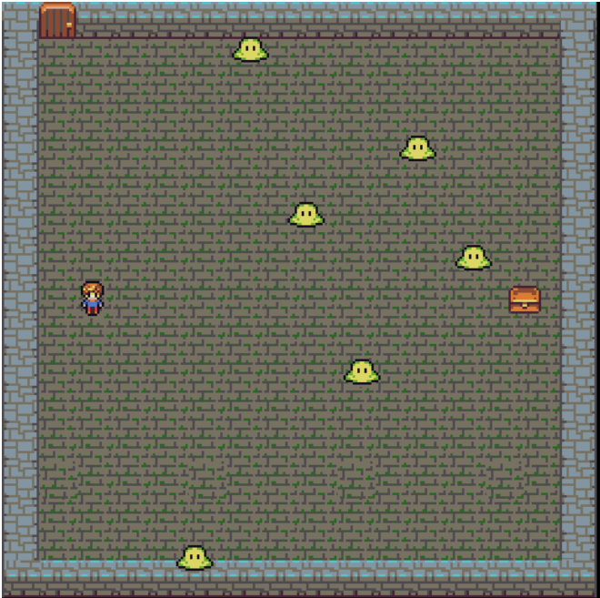

# Dungeon Hunter
A 2D pixel art game made using PixiJS. This game is implemented mostly following Rex van der Spuy's [Learn Pixi.js book](https://www.amazon.ca/Learn-Pixi-js-Rex-van-Spuy-ebook/dp/B01HXEJ4PC/ref=sr_1_1?ie=UTF8&qid=1513793710&sr=8-1&keywords=learn+pixi).

*Note: This repo is written in ES6 without a transpiler, so it will only run on Chrome for now. Transpiling will surely be added in the future!*

